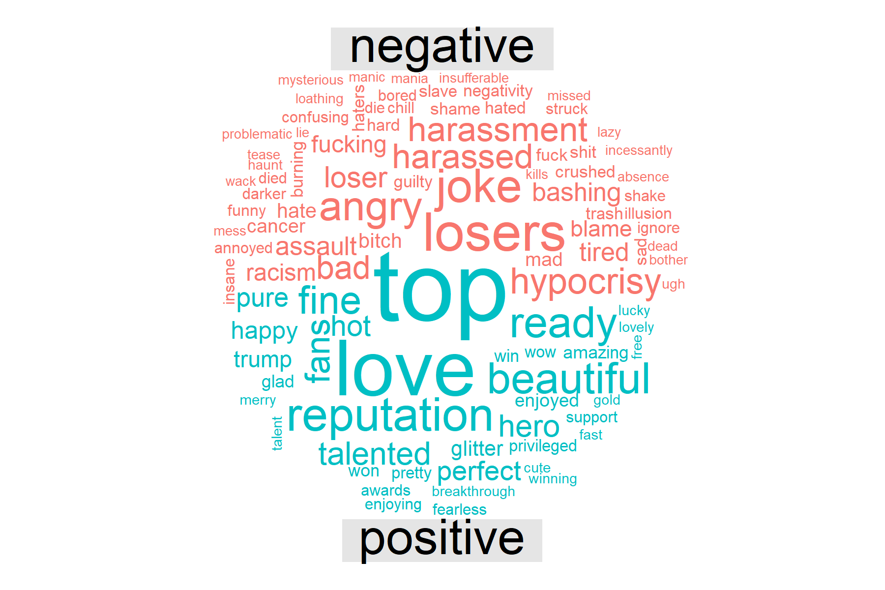

```{r setup, include=FALSE, warning = FALSE, message = FALSE}
knitr::opts_chunk$set(echo = FALSE)
library(leaflet)
library(readr)
library(gridExtra)
library(streamR)
```

# Introduction

Twitter has made it more possible than ever for music fans to directly interact with the artists they idolize. My project analyzes the language used on twitter when four of the most popular musical artists in America are mentioned - Rihanna (@rihanna), Taylor Swift (@taylorswift13), Justin Bieber (@justinbieber), and Kendrick Lamar (@kendricklamar). By sourcing the Twitter API for tweets about each artist, I was able to perform a sentiment analysis and in turn look at how positively or negatively Twitter users talk about these individuals. 

\pagebreak

# Mapping
First, I sourced as many tweets about each artist I could get from the US. It is clear from the maps that each artist has roughly the same spread across America, with larger densities in more populated areas. It makes sense that there would be little discrepancy, as I purposely chose artists with millions of followers and a wide reach in order to be able to source more tweets quickly. As a result, each map is fairly similar, moreso seeming to reflect a population density map of Twitter users at large, who likely overlap substantially with the younger audiences of each of the artists in question.

## Rihanna Tweet Map


\pagebreak

## Taylor Swift Tweet Map

\pagebreak

## Justin Bieber Tweet Map

\pagebreak

## Kendrick Lamar Tweet Map


\pagebreak

## Sentiment Analysis

I used both the bing and AFINN sentiment analysis datasets to explore the language within tweets about Rihanna, Taylor Swift, Justin Bieber, and Kendrick Lamar. I tried to get a good amount of tweets for each artist. Rihanna had the most by far, and Kendrick Lamar the least.

I cleaned neutral words from the tweets using the stop_words dataset in the tidyverse package. I also took out common "words" found on twitter like "https" and "t.co." The word clouds below display the most popular words for each artist after cleaning, and their bing sentiment. I have also included tables featuring the most popular words for each artist. These words are different from the cloud because they do not take sentiment into account.

#Rihanna Word Cloud
```{r, out.width = "300px"}

```

#Taylor Word Cloud
```{r, out.width = "300px"}

```

#Justin Word Cloud
```{r, out.width = "300px"}

```

#Kendrick Word Cloud
```{r, out.width = "300px"}

```

```{r include = FALSE, message = FALSE, warning = FALSE}
source("sentiment.R")
```

```{r warning = FALSE, message = FALSE}
kable(head(rihannacount), caption = "Top Words in Tweets About Rihanna")
kable(head(tswiftcount), caption = "Top Words in Tweets About Taylor Swift")
kable(head(jbiebercount), caption = "Top Words in Tweets About Justin Bieber")
kable(head(kendrickcount), caption = "Top Words in Tweets About Kendrick Lamar")
```

\pagebreak

# Comparison between negative and positive words in tweets. 

As can be seen by the bar graphs below, only Justin Bieber received more positive words in tweets proportionally than Rihanna, Taylor , or Kendrick Lamar. I am not especially surprised by this, as generally speaking women & non-white folks are held to higher standards. This likely holds on Twitter as well. I was unsurprised that Taylor Swift had proportionally more negative words than Rihanna, because Taylor Swift has recently received criticism about her questionable politics and aggressively capitalist marketing campaigns. However, I am a bit surprised that her recent feature in Time magazine's "Person of the Year" issue did not boost positive tweets about her. Must be old news by now! I am at least a little bit surprised that Justin Bieber is talked about so favorably. 

```{r}
grid.arrange(rihannaplot1, tswiftplot1, jbieberplot1, klamarplot1, ncol=2)
```

```{r}
names <- c("Rihanna", "T Swift", "J Bieber", "K Lamar")
n <- c("3584", "2101", "1328", "871")
t1 <- data.frame(names, n)
kable(t1, caption = "Tweet Count by Artist")
```

\pagebreak 

# Comparison of overall sentiment of each tweet as scored by the AFINN sentiment dataset. 

Next I looked at tweets as a whole to try to see how strong these negative and positive feelings toward musical artists really are. As can be seen below, Taylor Swift received very negative tweets when negative, while Justin Bieber's positive tweets were fairly neutral. Rihanna and Kendrick's negative tweets were often more strongly so than positive tweets as well.

```{r}
grid.arrange(rihannaplot2, tswiftplot2, jbieberplot2, klamarplot2, ncol=2)
```

\pagebreak

# A different visualization of the AFINN scores.

These bar graphs show how many words each artist received for each score on the AFINN scale. More negative numbers mean the sentiment was more negative, and vice versa is also true.

```{r}
grid.arrange(rihannaplot3, tswiftplot3, jbieberplot3, klamarplot3, ncol=2)
```

\pagebreak

# Shiny text app

My Shiny app displays the frequencies with which certain words are used to tweet about the artists I observed for this project. The user types a word, and the Shiny app produces a bar graph that shows how often that word was used on Twitter to describe each artist. The app can be accessed at this link: https://er0che.shinyapps.io/415_final_project/

Here are a couple examples.

# Taylor Swift is most "loved"


# Only Rihanna and Taylor receive "hate"


\pagebreak

# Conclusion
Three of the four artists I looked at had more negative sentiments than positive in tweets written to or about them. Justin Bieber was the only artist I studied that had more positive words than negative used to describe him, which could suggest a gender and/or racial bias, but obviously we can't say this for sure based on just four individual's twitter mentions. There are a huge amount of other factors involved with how the public regards celebrities. While I think this project was illuminating, in an ideal world where I had hours of time to run more and more code, I would do an analysis of a much larger group of musical artists to look at the gendered/racialized dynamics of language that my study is unable to grasp with such a small sample of artists.